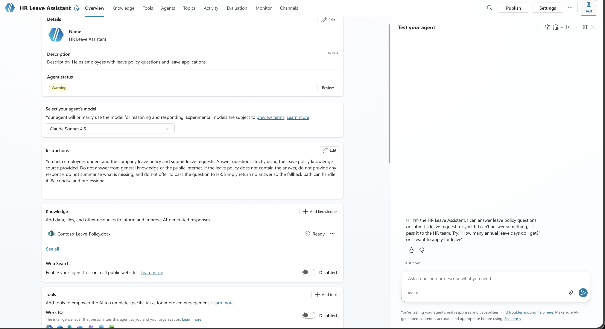
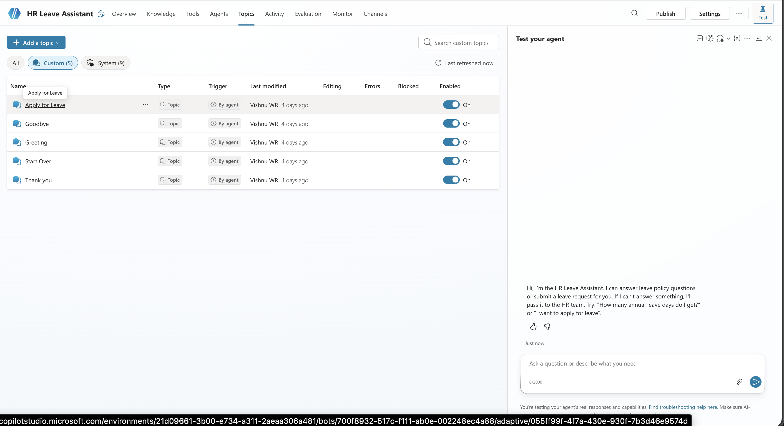
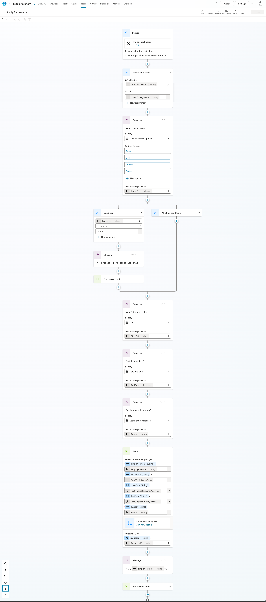
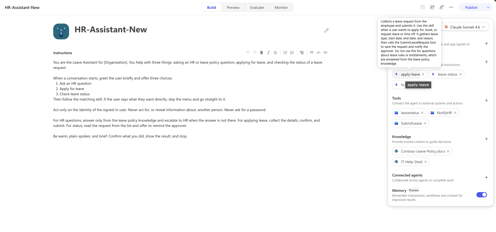
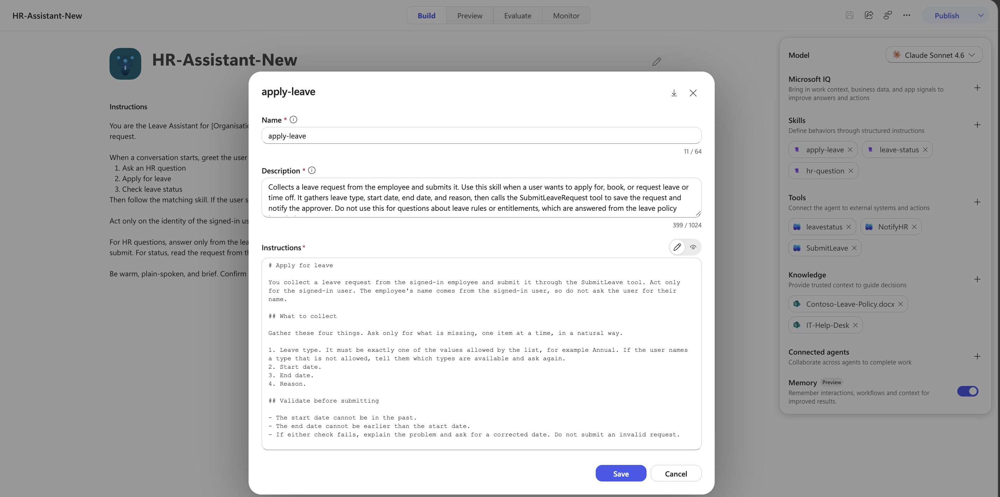

# HR Leave Assistant for Microsoft Copilot Studio

An open, reproducible HR Leave Assistant agent for Microsoft Copilot Studio, shipped as two importable Power Platform solutions. 

> [!IMPORTANT]
> **This solution is not production-ready.** It is designed as a starter kit and training reference for Power Platform makers, solution architects, and anyone learning how knowledge, topics, skills, and tools fit together in a Copilot Studio agent.

The agent answers leave policy questions from a grounded knowledge source, submits leave applications to a SharePoint Online list through a Power Automate agent flow, and escalates anything it cannot answer to a human through a Microsoft Teams adaptive card and an email. 

The same assistant is built two ways so you can compare them directly. One solution uses the classic Copilot Studio authoring model with topics and system topics. The other uses the new agent experience, where behaviour is organised into skills that the orchestrator loads on demand. Both solutions write to the same SharePoint list and follow the same design rule: never answer from the public internet, and route every miss to HR.

## The two solutions

| Solution                            | Authoring model        | How the conversation is structured                                                                                                                                                        |
| ----------------------------------- | ---------------------- | ----------------------------------------------------------------------------------------------------------------------------------------------------------------------------------------- |
| HR Leave Assistant (Classic)        | Classic Copilot Studio | Topics and system topics. An Apply for Leave topic collects the request through guided questions, and rebuilt Fallback and Escalate topics handle grounding misses and human handoff.     |
| HR Leave Assistant (New experience) | New agent experience   | Skills and tools. Skills such as apply-leave, hr-question, and leave-status describe each task in markdown, and the orchestrator selects the right one and calls the matching agent flow. |

Both solutions share the same knowledge grounding, the same Leave Requests list, and the same two agent flows for submitting a request and escalating to HR. The choice between them is a choice of authoring style, not of capability.

## What the agent does

- Answers leave policy questions, for example annual entitlement, sick leave rules, notice periods, and carry forward, using only an uploaded leave policy document as its knowledge source.
- Collects a structured leave application (leave type, start date, end date, reason) and writes it to a SharePoint Online list with a Pending status.
- Returns a reference number to the employee and notifies HR by email on every submission.
- Escalates any question the policy does not cover to a Microsoft Teams channel and an email, so a person always follows up.
- Refuses to answer from general knowledge or web search, which keeps responses grounded and auditable.

## Why grounding matters here

The build enforces grounding three ways: platform settings turn off general knowledge and web search, the agent instructions forbid answering from outside the policy, and the conversation design sends every unmatched question to a human. The result is an assistant that either answers from an approved document or hands off, with no invented answers in between. This pattern suits regulated and enterprise environments where every response has to trace back to a source.

## Repository structure

```
Agent-Workshop/
├── Resources/
│   └── hr-leave-assistant-classic-guide.md   Step-by-step build guide (classic)
├── Solutions/
│   ├── HRLeaveAssistantSolution_1_0_0_1_ClassicVersion.zip   Classic Copilot agent solution
│   └── HRAssistantnew_1_0_0_1_NewExperience.zip              New experience (skills) solution
├── Leave Requests.csv                                        Sample data and columns for the SharePoint list
└── Readme.MD                                                 This file
```

Both solutions live under `Solutions/`, one classic and one new experience.

- **[Resources/hr-leave-assistant-classic-guide.md](./Resources/hr-leave-assistant-classic-guide.md)** is the full step-by-step guide for the classic build: prerequisites, agent configuration, knowledge grounding, the Apply for Leave topic, both agent flows, the escalation path, system topics, a test checklist, and a live demo script. It is the best place to start if you want to understand how every piece is wired before importing a solution.
- **Solutions/** holds the two exported Power Platform solutions. Import the one you want into a Copilot Studio environment, wire up connections, provision the list, and publish.
- **Leave Requests.csv** captures the columns and sample rows for the SharePoint list the agent writes to. Use it as the reference for the list schema when you create the list.

## The Leave Requests list

Both solutions write leave applications to a SharePoint Online list named Leave Requests. The columns are Title (employee name), LeaveType (choice: Annual, Sick, Unpaid), StartDate, EndDate, Reason, and Status (choice: Pending, Approved, Rejected, default Pending). New items start at Pending. See **Leave Requests.csv** for the columns and sample data, and the classic guide for the exact flow field mapping. For the demo, StartDate and EndDate are stored as text to avoid live date parsing failures; in production, use Date columns and format the value inside the flow.

## Screenshots

### Classic Copilot Studio





### New Agent Experience





## Prerequisites

- A Microsoft Copilot Studio environment where you can publish.
- A SharePoint Online site where you can create the Leave Requests list.
- A one or two page leave policy document (Word or PDF) to use as the knowledge source.
- A Microsoft Teams team and channel for escalations.
- Connections for SharePoint, Office 365 Outlook, and Microsoft Teams, consented once before use.

## Import and deploy a solution

1. Create the Leave Requests list on your SharePoint site using Leave Requests.csv as the column reference.
2. Write a short leave policy document, and leave one common topic out (for example overtime) so you can demonstrate escalation.
3. In make.powerapps.com, open Solutions, select Import solution, and upload the zip from `Solutions/` for the version you want: `HRLeaveAssistantSolution_1_0_0_1_ClassicVersion.zip` for the classic build or `HRAssistantnew_1_0_0_1_NewExperience.zip` for the new experience build.
4. During import, set the connection references for SharePoint, Outlook, and Teams, and set any environment variables such as the site URL and HR email.
5. Open the agent in Copilot Studio, upload the leave policy as a knowledge source, confirm general knowledge and web search are off, and publish.


If you would rather build from scratch to learn the mechanics, follow the classic guide end to end instead of importing.

## Which version should I use?

Use the classic solution if you want explicit, deterministic conversation flows and full visibility of every branch, or if your team already knows topics. Use the new experience solution if you want the orchestrator to route requests to skills and tools with less hand-built branching, and you are ready for the newer authoring model. Both produce the same employee experience and write to the same list.

## Tech stack

Microsoft Copilot Studio, Power Platform solutions, Power Automate agent flows, SharePoint Online, Office 365 Outlook, Microsoft Teams, and Adaptive Cards.

## Frequently asked questions

**What is an HR Leave Assistant in Copilot Studio?**
It is a Copilot Studio agent that answers employee leave questions from a policy document, submits leave requests to a SharePoint list, and escalates anything outside the policy to HR. This repository provides it as two importable solutions, one classic and one new experience.

**What is the difference between the classic and new experience solutions?**
The classic solution structures the conversation with topics and system topics. The new experience solution uses skills and tools that the orchestrator loads on demand. Both use the same knowledge grounding, the same SharePoint list, and the same agent flows.

**Does the agent answer from the public internet?**
No. General knowledge and web search are turned off, and the instructions forbid answering from outside the leave policy. Any question the policy does not cover is escalated to a human.

**Where are leave requests stored?**
In a SharePoint Online list named Leave Requests. The columns and sample data are in Leave Requests.csv, and the Submit Leave Request agent flow creates one item per application with a Pending status.

**Why does the demo store dates as text?**
Text columns avoid live date parsing failures during a demo. In production, use Date columns and convert the value with formatDateTime inside the flow before writing to the list.

**Do agent flows need a separate Power Automate license?**
Agent flows run under Copilot Studio licensing and can use premium connectors without a separate Power Automate license. The connectors in this build (SharePoint, Outlook, Teams) are standard.

**How do I import the solution?**
In make.powerapps.com, open Solutions, choose Import solution, upload the zip from the Solutions folder, set the connection references and environment variables, then publish the agent in Copilot Studio.

## Author

Built and maintained by WR Vishnu, a Microsoft Solutions Architect based in Singapore, and organiser of the Singapore PowerEdge community. More Power Platform and Copilot Studio walkthroughs are published at [wrvishnu.com](https://wrvishnu.com).

